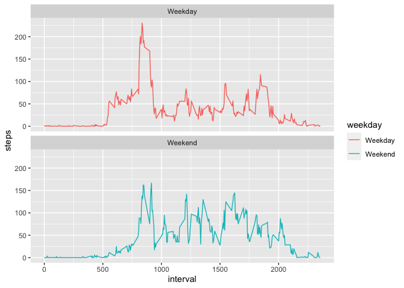

## Loading and preprocessing the data

Load data to R.


```r
library(readr)
activity <- read_csv("activity.csv")
```

```
## Parsed with column specification:
## cols(
##   steps = col_double(),
##   date = col_date(format = ""),
##   interval = col_double()
## )
```

## Mean total number of steps per day

A quick glance at the dataset and the first 6 observations.

```r
summary(activity)
```

```
##      steps             date               interval     
##  Min.   :  0.00   Min.   :2012-10-01   Min.   :   0.0  
##  1st Qu.:  0.00   1st Qu.:2012-10-16   1st Qu.: 588.8  
##  Median :  0.00   Median :2012-10-31   Median :1177.5  
##  Mean   : 37.38   Mean   :2012-10-31   Mean   :1177.5  
##  3rd Qu.: 12.00   3rd Qu.:2012-11-15   3rd Qu.:1766.2  
##  Max.   :806.00   Max.   :2012-11-30   Max.   :2355.0  
##  NA's   :2304
```

```r
head(activity)
```

```
## # A tibble: 6 x 3
##   steps date       interval
##   <dbl> <date>        <dbl>
## 1    NA 2012-10-01        0
## 2    NA 2012-10-01        5
## 3    NA 2012-10-01       10
## 4    NA 2012-10-01       15
## 5    NA 2012-10-01       20
## 6    NA 2012-10-01       25
```

Calculate the total number of steps by introducing a new library dplyr, and then plot a histogram about it. After that, also show mean and median number for total steps per day.

```r
library(dplyr)
```

```
## 
## Attaching package: 'dplyr'
```

```
## The following objects are masked from 'package:stats':
## 
##     filter, lag
```

```
## The following objects are masked from 'package:base':
## 
##     intersect, setdiff, setequal, union
```

```r
step_by_date <- aggregate(steps~date, data = activity, FUN = sum, na.rm = TRUE)
colnames(step_by_date) <- c("date", "total_steps")
# show total steps
step_by_date
```

```
##          date total_steps
## 1  2012-10-02         126
## 2  2012-10-03       11352
## 3  2012-10-04       12116
## 4  2012-10-05       13294
## 5  2012-10-06       15420
## 6  2012-10-07       11015
## 7  2012-10-09       12811
## 8  2012-10-10        9900
## 9  2012-10-11       10304
## 10 2012-10-12       17382
## 11 2012-10-13       12426
## 12 2012-10-14       15098
## 13 2012-10-15       10139
## 14 2012-10-16       15084
## 15 2012-10-17       13452
## 16 2012-10-18       10056
## 17 2012-10-19       11829
## 18 2012-10-20       10395
## 19 2012-10-21        8821
## 20 2012-10-22       13460
## 21 2012-10-23        8918
## 22 2012-10-24        8355
## 23 2012-10-25        2492
## 24 2012-10-26        6778
## 25 2012-10-27       10119
## 26 2012-10-28       11458
## 27 2012-10-29        5018
## 28 2012-10-30        9819
## 29 2012-10-31       15414
## 30 2012-11-02       10600
## 31 2012-11-03       10571
## 32 2012-11-05       10439
## 33 2012-11-06        8334
## 34 2012-11-07       12883
## 35 2012-11-08        3219
## 36 2012-11-11       12608
## 37 2012-11-12       10765
## 38 2012-11-13        7336
## 39 2012-11-15          41
## 40 2012-11-16        5441
## 41 2012-11-17       14339
## 42 2012-11-18       15110
## 43 2012-11-19        8841
## 44 2012-11-20        4472
## 45 2012-11-21       12787
## 46 2012-11-22       20427
## 47 2012-11-23       21194
## 48 2012-11-24       14478
## 49 2012-11-25       11834
## 50 2012-11-26       11162
## 51 2012-11-27       13646
## 52 2012-11-28       10183
## 53 2012-11-29        7047
```

```r
# make a histogram plot
hist(step_by_date$total_steps, breaks = seq(0,25000, by = 2500), xlab = "Total steps per day", main = "Total steps taken per day")
```

<!-- -->

```r
# take a look for mean and median value of the statistics
paste("The mean is ", mean(step_by_date$total_steps))
```

```
## [1] "The mean is  10766.1886792453"
```

```r
paste("The median is ",median(step_by_date$total_steps))
```

```
## [1] "The median is  10765"
```

## Average daily activity pattern

Firstly, make a time series plot with 5 min interval and average steps taken each day throughout the whole period.


```r
avg_activity <- aggregate(activity$steps, by = list(activity$interval), FUN = mean, na.rm = TRUE)
names(avg_activity) <- c("interval", "steps")
with(avg_activity, plot(steps~interval, type = "l"))
```

<!-- -->

Then, figure out which 5 min interval contains the maximum number of steps.

```r
avg_activity[which.max(avg_activity$steps),]$interval
```

```
## [1] 835
```

## Input missing values

Firstly, search total number of missing values (NAs) in the dataset. It seems there are 2304 NAs in the dataset.

```r
sum(is.na(activity))
```

```
## [1] 2304
```

Secondly, filling the NAs by mean of 5 min interval, and create a new dataset named new_activity


```r
activity$steps[is.na(activity$steps)] <- avg_activity$steps
new_activity <- activity
```

Then, make a histogram again with mean and median values.


```r
new_step_by_date <- aggregate(steps~date, new_activity, FUN = sum)
colnames(new_step_by_date) <- c("date", "steps")
hist(new_step_by_date$steps, breaks = seq(0,25000, by = 2500), xlab = "Total steps per day (new)", main = "Total steps taken per day (new)")
```

<!-- -->

```r
paste("The new mean is ", mean(new_step_by_date$steps))
```

```
## [1] "The new mean is  10766.1886792453"
```

```r
paste("The new median is ",median(new_step_by_date$steps))
```

```
## [1] "The new median is  10766.1886792453"
```
After being compared with the original dataset, it seems that filling of data with mean value of intervals increases the estimation of total daily number of steps.

## Are there differences in activity patterns between weekdays and weekends?

Determine if the day is weekday or weekend.

```r
new_activity$weekday <- sapply(new_activity$date, function(x){
  if (weekdays(x) == "Saturday" | weekdays(x) == "Sunday")
      {y <- "Weekend"} 
  else
      {y <- "Weekday"}
      y
})
```

make a new panel plot.

```r
library(ggplot2)
new_activity_by_date <- aggregate(steps~interval + weekday, data = new_activity, FUN = mean, na.rm = TRUE)
ggplot(new_activity_by_date, aes(x = interval, y = steps, colour = weekday)) +
  geom_line() +
  facet_wrap(~weekday, ncol = 1, nrow = 2)
```

<!-- -->
